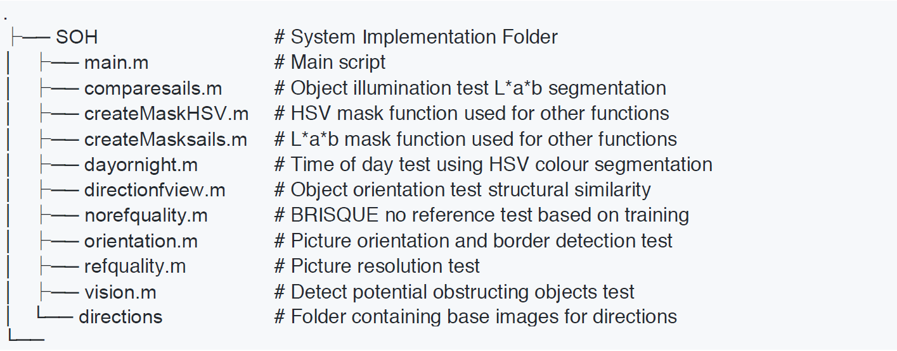

# How to recognise one of the most recognisable buildings on earth
## Semi-automated subjective image preference in MATLAB

  

Implementation of a MATLAB-based automated system that orders a number of images of the Sydney Opera House from ‘best’ to ‘worst’ based on a number of subjective criteria created with respect to the ‘recognisability’ and ‘quality’ of an image. This process aimed to address the challenges and possibilities associated with mimicking subjective preference on images in an automated computer-based environment, which is a promising approach to a number of applications in the area of digital image processing. The proposed solution employs a number of techniques in morphological image processing, segmentation, feature detection, and image classification that attempt to mimic a list of criteria that were explicitly defined through human image ordering testing. An iterative development and testing approach led to successful ordering of the majority of images in a validation dataset, and the identification of key aspects and opportunities in achieving success in this area of digital image processing.

### Introduction
Digital image processing, as a computer-based technology, carries out automatic processing, manipulation and interpretation of such visual information, and it plays an increasingly important role in many aspects of our daily life, as well as in a wide variety of disciplines and fields in science and technology.

Mimicking subjective preference on visual information is one area of automating image interpretation in digital image processing. Humans naturally perform preference assessments on visual information based on a number of factors, many of which can only be
expressed through general adjective language. Preference can be weighted towards many ideas such as recognisability, familiarity and danger or safety. Automating this process requires the interpretation of adjective language into computational techniques.

The ability to mimic subjective preference for images in an automated computer environment has increasing application with respect to search engines, computerized photography, and the medical and manufacturing industry. This notion of increasing the efficiency of any process that favours the use of tests based on abstract human judgement criteria extends beyond image processing to applications such as improved customer focus in digital marketing, better recommendations in the service industry, and automated reduction in the size of a dataset in data science applications.

Approaching this emerging area in digital image processing to the scope of mimicking subjective preference for images of a well-known, and unique architectural structure; the Sydney Opera House, gives insight into the various image processing techniques that can be employed, along with the underlying themes in the wider area of mimicking subjective preference.

### Problem Space
The Sydney Opera House is a very recognisable building, both objectively and as a cultural icon. It is a unique architectural design and structure characterised by its white sails and sharp corners. The shape that is seen differs depending on the direction it is viewed from. As an outdoor attraction, weather and lighting factors affect the viewing experience in person. In transferring the viewing of the Sydney Opera House to a digital image, these aspects of the viewing experience, along with quality-based aspects of digital image capture and encoding, create a situation in which the degree to which an image of the Opera House is ‘good’ and ‘recognisable’ differs significantly between images. The training, testing, and validation datasets that were used in this task reflect the diversity in available images of the Opera House, varying in quality, direction of view, time of day, object illumination, background, and foreground. This presented the problem of establishing explicit criteria that favours certain
versions of each of these aspects, and subsequently translating the adjective language descriptions into a digital image processing technique.

### Solution Development and Implementation
The approach taken in developing a system in MATLAB that could order images based on the criteria described above was done  incrementally and iteratively. A main script was created to read all of the images in specified folders (to be adjusted for training, testing, or validation) and from this, a number of function could be called to return an array with a length defined by the number of images, containing the scores received for a particular test or assessment. After all point score arrays are returned, they are added together and ordered such that the highest number of points ranks the respective image first. The sorting algorithm used is stable which means images with the same score would be ranked in the
same order as they were in the dataset. It was found that it was not entirely possible to transfer adjective language that describes a criterion to a MATLAB function entirely in all cases, and as such a number of other techniques commonly applied for image quality
assessments where employed to improve the systems performance.

The source code for the system follows the following structure:

  

All functions excluding the two mask functions (which are used for segmentation in individual tests) are called by the main script. The decision to develop a solution in this configuration was made to make it easier to work collaboratively and introduce or remove certain tests quickly. This also assisted in making the solution easily readable. Each of the functions implemented draws on common techniques in digital image processing and are as follows:

<strong>Object Illumination: Lab colour segmentation (comparesails.m, createMasksails.m)</strong>

This looks at the sails of the opera house in the image and locates
them using colour segmentation in the L*a*b domain and compared to a base image with known good illumination. Images where the sails are more consistently illuminated (less shadows or more lighting) are favoured, and the final points are based on a similarity index
which is scaled highest to lowest from 0 to 3.

The implementation of this test was carried out by creating a mask from colour segmentation in the CIELAB colour space. A general mask function was created using the Colour Thresholder App in MATLAB to isolate the lighter areas in the image that were in the cream colour area of the sails. The success of this masking between successive images was good, however the subsequent process involved comparing this with a known opera house mask with structural similarity index which is based on the luminance, contrast and structure of an image. Analysis on the masked area may have been better achieved with morphological image processes to locate holes, or comparison with a mask from an image known to be taken from the same direction.

<strong>Time of Day: HSV colour segmentation (dayornight.m, createMaskHSV.m)</strong>

This looks at the brightest area of the region via colour segmentation in HSV to determine whether the images have been taken at night or during the day, in which case the upper area of the image (and the sails) will make this mask. An image classified as being taken in the daytime are assigned 2 points, others are given 0 points.

The implementation of this test was carried out similarly to Object Illumination by creating a mask, which is this case was done in the HSV colour space. Testing on images in the training by assessing the location of 0’s in binary set found this to be more accurate in
locating the favourably bright and blue sky in daytime. This implementation proved to be accurate with 1 image (taken at sunset) being incorrectly identified. The analysis of the masked area was performed simply by determining if it was located in the expected sky area.

<strong>Object Orientation: image similarity comparison (directionfview.m)</strong>

This looks at the orientation of the Opera House in an image –
classified by 8 positions (N, S, E, W, NE, NW, SE, SW) by comparing structural similarities of a known base image facing that orientation. Images classified as having E, W, SE, NE are assigned 3 points, and others are given 0 points.

Accurately determining the direction from which an image was taken proved to be a difficult task. An unsuccessful attempt at implementing semantic segmentation based on labels created for different orientation. The final implemented function involves choosing the most similar image from a static list of images for each of 8 cardinal directions. The Computer Vision System Toolbox was used to implement the Bag of Visual Words technique with the
content-based image retrieval system (CBIR). This selects an image from a defined group using the reference image in the set being ordered and creates a Bag of Features using the speeded up robust features (SURF) function which is implemented simply.

<strong>Picture Orientation and Borders: general matrix manipulation (orientation.m)</strong>

This looks at the orientation of the image (where landscape images
are favourable) and checks for black borders/cropping as this is undesirable. This is done using simple matrix indexing and assigns landscape images 2 points, square images 1 point, and portrait or bordered images 0 points.

Picture orientation can be determined by indexing the image matrix to see if a row of pixels in the y direction is longer, or shorter than the number of pixels in the x direction. If found to be 15% larger, the image is subject to a score relating to portrait orientation. Square images are determined if pixels x, and y are within 80%, and landscape images are determined when these two statements are false. Borders in images are determined when 5% of the image pixels in either direction are found to be a value of 0, once the image is converted to grayscale ranging 0 - 255. This is done with simple matrix indexing.

<strong>Picture Resolution: general matrix manipulation (refquality.m)</strong>

This looks at the entire image and makes a determination of relative
quality based on resolution and colour encoding, under the assumption that the application of these images are in a 4x6 inch photos. Images above 300ppi are assigned 3 points, below 70ppi 1 point, and in-between 0 points.

This test was also implemented using simple matrix indexing techniques. Resolution of an image is determined by firstly, calculating the pixel length in both direction, followed by
calculating the pixels per inch relative to 4x6 inch image. Once the diagonal PPI was calculated, the values for each image was compared to a quality threshold.

<strong>Picture Quality: no reference BRISQUE model implementation (norefquality.m)</strong>

This test was also implemented using simple matrix indexing techniques. Resolution of an image is determined by firstly, calculating the pixel length in both direction, followed by
calculating the pixels per inch relative to 4x6 inch image. Once the diagonal PPI was calculated, the values for each image was compared to a quality threshold.

To further improve the ordering process, a popular MATLAB method for assessing image quality; the Blind/Referenceless Image Spatial Quality Evaluator (BRISQUE) was applied to the testing and validation sets using the subjective ordering scores acquired in the criteria development phase. This works with a number of techniques assigning high and low scores depending on noise (spatially correlated and AWGN), blur, shift, and change in contrast. This is implemented by fitting a model with an array of subjective ordering scores and then applying the model to a specific image in a loop. Then, each images score was scaled down
to an appropriate weighting and added to the overall points.

<strong>Object Recognition: pre-trained GoogLeNet neural network (vision.m)</strong>

This looks for objects in the image identified by a neural network to classify potential obstructions. This includes both negative and positive features such as boats or the Opera House itself and attracts a point score between 0 and 5 defined during testing.

In an attempt to address the criteria for the absence of obstructing objects in the images, an image classifier was implemented using a pretrained convolutional neural network
GoogLeNet. This was implemented by defining the net, resizing the input images, and then using the classify function to store the identified object as well as percentage certainty that it
has been identified correctly. This network was compared with each image, returning likelihood probabilities of detected objects, with examples shown below.